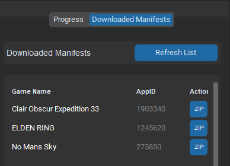
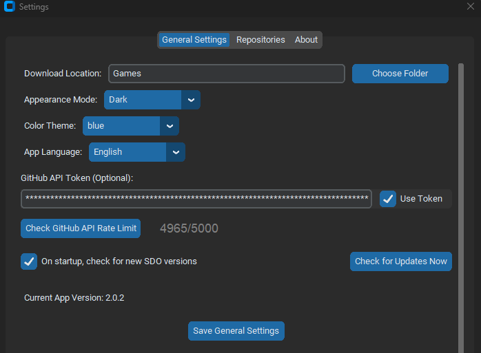
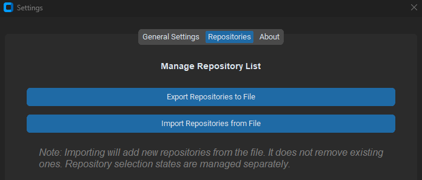

# Steam Depot Online (SDO)

<div align="center">
  
</div>

## Overview

**Steam Depot Online (SDO)** is a feature-rich tool for downloading and managing Steam game data. This application fetches manifests, `key.vdf` data, or entire game depot zips from GitHub repositories. For standard manifest/key downloads, it generates Lua scripts for decryption keys and compresses the outcome into a zip archive. For "Branch" type repositories, it downloads the game's pre-packaged zip directly.

**Version 2.0.2 introduces significant enhancements including persistent settings, multi-language support (now with FR, CN, DE, ES, IT, PT, JP, IN, RU), an integrated update checker, batch downloading of AppIDs, a dedicated tab to manage downloaded manifests, GitHub API Token integration for improved rate limits, and a more robust backend for repository processing.**

<div align="center">
  
  <br>
  <em>Main Application Interface</em>
</div>

<div align="center">
  
  <br>
  <em>Downloaded Manifests Tab</em>
</div>

<div align="center">
  
  <br>
  <em>Settings Window - General Tab</em>
</div>

<div align="center">
  
  <br>
  <em>Settings Window - Repositories Tab</em>
</div>

**Note**: To update manifests, consider using this tool:
[Lua Manifest Updater](https://github.com/fairy-root/lua-manifest-updater)

---

## Features

- **GitHub Repository Integration**:
  - Add or delete repositories containing Steam game data.
  - Support for **Encrypted**, **Decrypted**, and **Branch** repository types with selection toggles.
  - **Your repository selections are now saved and restored between sessions.**
  - **Export and Import** your entire repository list to/from a JSON file via settings.

- **GitHub API Token Support**:
  - **Increase Rate Limits**: Optionally add your GitHub Personal Access Token (PAT) in settings to significantly boost API request limits (from ~60/hour to ~5000/hour).
  - **Enhanced Access**: Use your token for fetching repository data and downloading "Branch" zips, potentially enabling access to private repositories if your token has permissions.
  - **Rate Limit Checker**: A built-in tool in settings to verify your current GitHub API rate limit status (authenticated or unauthenticated).

- **Search Functionality**:
  - Search for games by name or AppID.
  - Displays matching results with game names, AppIDs, and **small game capsule images** for easier identification.

- **Flexible Download Options**:
  - **Single Game Download**: Download the game selected from search results.
  - **Batch AppID Download**: Enter multiple AppIDs (separated by commas or newlines) in the input field, and the tool will download them sequentially.
  - **Encrypted/Decrypted Repos**: Fetches manifests and `key.vdf` files directly via GitHub API (more efficient). Generates Lua scripts for use with Steam emulators.
  - **Branch Repos**: Downloads a direct `.zip` archive of an AppID's branch from GitHub (e.g., `AppID.zip`) using the API `/zipball/` endpoint (respects token).

- **Output Packaging**:
  - All successful downloads result in a file named `{GameName}-{AppID}.zip` (or similar if encrypted) located in your configured download directory.
  - **Encrypted/Decrypted Repos**: The zip contains downloaded files (manifests, VDFs if non-strict) and the generated `.lua` script. The temporary processing directory is automatically cleaned up.
  - **Branch Repos**: The zip is the direct archive downloaded from the GitHub branch.

- **Persistent Application Settings**:
  - Your window size, theme, download path, strict validation preference, repository selections, and GitHub token settings are **automatically saved and loaded**.

- **Multi-language Support (Localization)**:
  - Change the application's display language via the settings.
  - **Now includes translations for: English, German (Deutsch), Spanish (Español), Italian (Italiano), Portuguese (Português), Japanese (日本語), Hindi (हिंदी), Russian (Русский).**
  - Supports adding custom translation files (JSON format) in the `lang/` directory. UI text, including tab titles, updates dynamically.

- **Integrated Update Checker**:
  - Automatically checks for new SDO versions on startup (configurable in settings).
  - Manually check for updates anytime from the settings window. Uses GitHub token if configured.

- **Downloaded Manifests Tab**:
  - A new tab providing a clear list of all successfully downloaded game `.zip` files in your output directory.
  - Quickly open the downloaded zip's location in your file explorer.

- **Enhanced UI Navigation & Control**:
  - **Quick Output Folder Access**: A dedicated button to open the configured download folder.
  - **Informative Tooltips**: Hover over UI elements for helpful descriptions.
  - **Keyboard Shortcuts**: Ctrl+V to paste, Enter to search.
  - **Refined "About" Tab**: Updated with detailed explanations of new features and selectable text for easy copying.

---

## Installation

### Prerequisites

1.  Install Python 3.8 or higher.
2.  Install the required dependencies:

    ```bash
    pip install -r requirements.txt
    ```
    (Alternatively: `pip install asyncio aiohttp aiofiles customtkinter vdf pillow`)

---


### Clone the Repository

```bash
git clone https://github.com/fairy-root/steam-depot-online.git
cd steam-depot-online
```

---

## How to Get a GitHub Personal Access Token (PAT)

A Personal Access Token (PAT) is an alternative to using passwords for authentication to GitHub when using the GitHub API or command line. It's more secure because you can grant specific permissions and revoke it at any time. Using a PAT with SDO is **highly recommended** to avoid GitHub API rate limits.

### Steps to Create a PAT:

1.  **Log in to GitHub:**
    *   Go to [github.com](https://github.com) and log in with your GitHub account.

2.  **Navigate to Settings:**
    *   In the upper-right corner of any page, click your profile photo, then click **Settings**.

3.  **Go to Developer Settings:**
    *   In the left sidebar, scroll down and click **Developer settings**.

4.  **Select Personal Access Tokens:**
    *   In the left sidebar, under "Developer settings", click **Personal access tokens**.
    *   Then, click on **Tokens (classic)**. *While "Fine-grained tokens" are newer, "Tokens (classic)" are often simpler for general API access like SDO might use and are widely supported.*

5.  **Generate a New Token:**
    *   Click **Generate new token**.
    *   You might be prompted to confirm your password.

6.  **Configure Your Token:**

    *   **Note (Description):** Give your token a descriptive name. This helps you remember what the token is for (e.g., "SDO Access Token", "My Script Token").

    *   **Expiration:** Select an expiration period for your token.
        *   For security, it's good practice to set an expiration date.
        *   You can choose from presets (e.g., 7 days, 30 days, 90 days) or set a custom date.
        *   If you choose "No expiration," be extra careful with the token.

    *   **Select Scopes (Permissions):** This is the most crucial part. Scopes define what actions the token can perform.
        *   For tools like SDO that primarily read public repository data and might download zips via the API, you generally don't need extensive write permissions.
        *   **Recommended Minimum Scopes for SDO:**
            *   `public_repo`: Grants read-only access to public repositories. This is often sufficient for accessing public game data repositories.
        *   **If you intend to access private repositories (that you own or have access to):**
            *   You might need the full `repo` scope. **Be very careful with this scope as it grants full control of repositories.** Only use it if absolutely necessary and you understand the implications.
        *   **To select a scope, check the box next to it.**

7.  **Generate Token Button:**
    *   Once you've configured the note, expiration, and scopes, click the **Generate token** button at the bottom of the page.

8.  **Copy Your New Token:**
    *   **IMPORTANT:** Your new PAT will be displayed on the screen **only once**.
    *   **Immediately copy the token to a secure place.** If you navigate away from the page or refresh, you will not be able to see it again and will have to regenerate a new one.
    *   Click the copy icon next to the token.

### Using Your PAT with SDO:

**Note:** SDO stores your PAT in settings.json locally on your device, and it is used for authenticated requests, and nothing else.

1.  Once you have copied your new PAT, open SDO.
2.  Click the **"Settings"** button.
3.  Go to the **"General Settings"** tab.
4.  Paste your PAT into the **"GitHub API Token (Optional)"** field.
5.  Ensure the **"Use Token"** checkbox next to it is checked.
6.  Click **"Save General Settings"**.
7.  Restart.

### Security Best Practices for PATs:

*   **Least Privilege:** Only grant the scopes (permissions) your token absolutely needs.
*   **Expiration Dates:** Set an expiration date for your tokens. Regenerate them when they expire if still needed.
*   **Secure Storage:** Store your tokens securely, for example, in a password manager.
*   **Regular Review:** Periodically review your active tokens and revoke any that are no longer needed.
*   **Do Not Hardcode:** Avoid hardcoding tokens directly into scripts or applications that might be shared or committed to public repositories. SDO stores it locally in your `settings.json` file, which should not be shared.

If you lose a token or suspect it has been compromised, go back to the "Personal access tokens" page on GitHub and delete (revoke) it immediately, then generate a new one.

---

## Usage

1.  **Run the Tool**:

    ```bash
    python app.py
    ```
    (Or `python3 app.py` depending on your Python setup)

2.  **Initial Setup (First Time or After Resetting Settings)**:
    - Go to **"Settings" > "General Settings"**.
    - **GitHub API Token**: (Highly Recommended) Enter your GitHub PAT (see section above for how to get one) and check "Use Token".
    - **Download Location**: Set your preferred folder for game downloads.
    - **Language**: Choose your preferred application language.
    - Click **"Save General Settings"**.

3.  **Features Explained**:
    - **Add GitHub repositories** by clicking "Add Repo". Provide the repository name (e.g., `user/repo`) and select its type: **Encrypted**, **Decrypted**, or **Branch**.
    - **Select desired repositories** for searching/downloading. Use "Select All" buttons or individual checkboxes for each repository type. Your selections will be saved automatically.
    - **Configure "Strict Validation"** (applies only to Encrypted/Decrypted types). This setting is also saved.
    - **Enter a game name or AppID** in the input field. For batch download, you can enter multiple AppIDs separated by commas or newlines.
    - Click "Search" to find games by name/AppID and see results.
    - Choose your download mode:
        - **"Selected game in search results"**: Downloads the game you've clicked on from the search results.
        - **"All AppIDs in input field"**: Downloads all AppIDs currently typed into the input field (useful for batch operations).
    - Click "Download".

4.  **Output & Management**:
    - All successful downloads will result in a file named `{GameName}-{AppID}.zip` (or similar if encrypted) located in your configured download directory (default: `./Games/`).
    - **For Encrypted/Decrypted Repos**: The zip contains downloaded files (manifests, VDFs if non-strict) and the generated `.lua` script.
    - **For Branch Repos**: The zip is the direct archive downloaded from the GitHub branch.
    - Access the **"Downloaded Manifests" tab** to see a list of your downloaded zips and quickly open their location.
    - Change your default download folder and other application preferences via the **"Settings"** button.

---

## Notes

1.  **Understanding Repository Types & Download Behavior**:

    -   **Decrypted Repositories**:
        -   Usually contain necessary decryption keys. Games are generally ready to play.
        -   The tool downloads manifests and keys, generates a `.lua` script, and zips these into the final output.
    -   **Encrypted Repositories**:
        -   May have the latest game manifests but decryption keys within their `key.vdf`/`config.vdf` might be hashed, partial, or invalid.
        -   The tool downloads manifests and keys, generates a `.lua` script (which might be minimal or require manual key replacement), and zips these. Games downloaded solely from here likely won't work directly ("Content is still encrypted" error).
    -   **Branch Repositories**:
        -   Provide a direct `.zip` download of an AppID's entire branch from GitHub.
        -   The tool saves this downloaded GitHub zip *as is* to the final output path.
        -   Strict Validation does *not* apply to Branch repositories.
        -   **Default Selection**: When a new repository is added or loaded for the first time without a saved selection state, only "Branch" type repositories will be selected by default.
    -   **If you just want a playable game**: Prioritize selecting "Decrypted" repositories. "Branch" repositories can also provide ready-to-use game data if the repository maintainer packages them correctly.
    -   **If you want the latest updates (and are willing to manually manage keys)**: "Encrypted" repositories might have the newest manifests. You would then need to source decryption keys elsewhere. or you can use the [Lua Manifest Updater](https://github.com/fairy-root/lua-manifest-updater)

2.  **Strict Validation Mode (Applies ONLY to Encrypted/Decrypted Repositories)**:
    -   **Checked (Default)**: The tool will strictly require `key.vdf` or `config.vdf` (prioritizing `key.vdf`) to be present in the AppID's branch for that repository to be considered valid. It prioritizes finding decryption keys and will download manifest files. If keys are found in a repo, processing for that AppID (from that repo type) stops there. `key.vdf`/`config.vdf` will **NOT** be included in the final tool-generated ZIP.
    -   **Unchecked**: The tool will download the *full content* (all files and folders recursively) of the AppID's branch from the first repository where it's found. It will still attempt to parse `key.vdf`/`config.vdf` if present within the downloaded content to extract keys for the `.lua` file. All downloaded files, including `key.vdf`/`config.vdf`, **WILL** be included in the tool-generated ZIP.

3.  **GitHub API Token (Recap)**:
    -   Using a GitHub Personal Access Token (PAT) is **highly recommended** to avoid API rate limits, especially for frequent use or downloading from many repositories. This also improves the reliability of fetching file trees and downloading "Branch" type zips. See the dedicated section above for instructions on obtaining and using a PAT.

4.  **"Content is still encrypted" Error (for non-Branch downloads)**:
    -   This means game files were downloaded but lack valid decryption keys in the generated `.lua` file.
    -   **Possible Solutions**: Try finding the game in a "Decrypted" repository, or manually source and replace the `DecryptionKey` values in the `.lua` file. Decryption keys for a specific depot ID are usually valid across different manifest IDs for that same depot.

---

## Changelog

See the [Changelog](changelog.md) file for more details.

## Donation

Your support is appreciated:

-   **USDt (TRC20)**: `TGCVbSSJbwL5nyXqMuKY839LJ5q5ygn2uS`
-   **BTC**: `13GS1ixn2uQAmFQkte6qA5p1MQtMXre6MT`
-   **ETH (ERC20)**: `0xdbc7a7dafbb333773a5866ccf7a74da15ee654cc`
-   **LTC**: `Ldb6SDxUMEdYQQfRhSA3zi4dCUtfUdsPou`

## Author

-   **GitHub**: [FairyRoot](https://github.com/fairy-root)
-   **Telegram**: [@FairyRoot](https://t.me/FairyRoot)

## Contributing

If you would like to contribute to this project, feel free to fork the repository and submit pull requests. Ensure that your code follows the existing structure, and test it thoroughly.

## License

This project is licensed under the MIT License - see the [LICENSE](LICENSE) file for details.