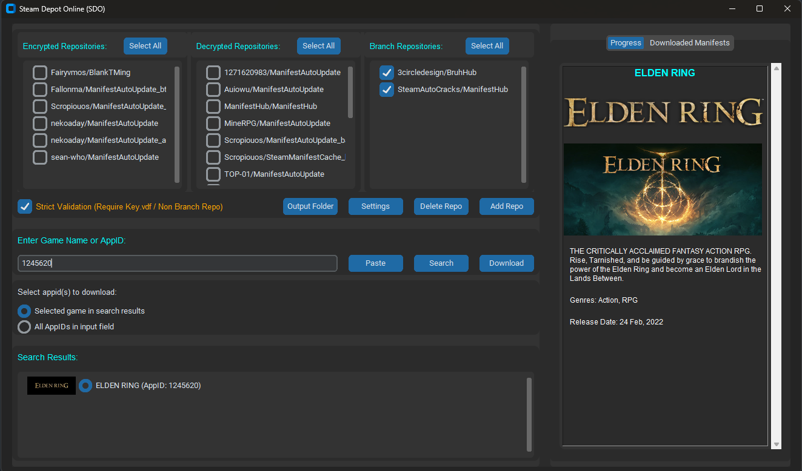

# Steam Depot Online (SDO)

<div align="center">
  
</div>

## Overview

**Steam Depot Online (SDO)** is a feature-rich tool for downloading and managing Steam manifests. This application fetches manifest and `key.vdf` data from GitHub repositories, generates Lua scripts for decryption keys, and compresses the outcome into a zip archive for easy access and sharing.

<div align="center">
  
</div>


**Note**: update the manifests using this tool
[Lua Manifest Updater](https://github.com/fairy-root/lua-manifest-updater)

---

## Features

- **GitHub Repository Integration**:

  - Add or delete repositories containing Steam manifest files.
  - Support for encrypted and decrypted repositories with selection toggles.

- **Search Functionality**:

  - Search for games by name or AppID via Steam's API.
  - Displays matching results with game names and AppIDs for user selection.

- **Manifest and Key Download**:

  - Fetches manifests and `key.vdf` files from selected repositories.
  - Generates Lua scripts for use with SteamTools.

- **Archive Packaging**:
  - Saves Lua scripts and manifests into zip files for easy management.

---

## Installation

### Prerequisites

1. Install Python 3.8 or higher.
2. Install the required dependencies:

   ```bash
   pip install asyncio aiohttp aiofiles customtkinter vdf
   ```

### Clone the Repository

```bash
git clone https://github.com/fairy-root/steam-depot-online.git
cd steam-depot-online
```

---

## Usage

1. **Run the Tool**:

   ```bash
   python app.py
   ```

2. **Features Explained**:

   - Add GitHub repositories for manifest data by clicking "Add Repo" and providing the repository name and type (Encrypted or Decrypted).
   - Search for games using their name or AppID in the search bar.
   - Select repositories and toggle between "Select All" or individual options for Encrypted or Decrypted types.
   - Begin downloading manifests for the selected game and repository via the "Download Manifest" button.

3. **Output**:
   - Lua scripts and manifests will be saved in the `Games/` directory and zipped automatically.

---

## Notes

1. **make sure to understand the following**:

- if you just want the game, then select all the decrypted repositories, and deselect the encrypted ones. the game will get downloaded if it was found in any repository

- **Strict Validation Mode & Download Behavior**
  - **Checked (Default)**: The tool will strictly require Key.vdf or config.vdf (found anywhere in the AppID branch) for a repository to be considered valid for an AppID. It prioritizes finding decryption keys and will download manifest files. If keys are found in a repo, it stops there. Key.vdf/config.vdf will NOT be included in the final ZIP.
  - **Unchecked**: The tool will download the *full content* (all files and folders recursively) of the AppID's branch from the first repository where it's found. It will still attempt to parse Key.vdf/config.vdf if present within the downloaded content to extract keys for the LUA file. All downloaded files, including Key.vdf/config.vdf, WILL be included in the ZIP.

- if you want the latest updates, you can get the encrypted game, then replace the decryption keys.
  - **Encrypted repositories** have latest manifests. (Games will not work)
  - **Decrypted repositories** have decryption keys. (Games ready to play)

2. The **encrypted repositories** have hashed decryption keys, their lua files can be installed, but the games won't run. they would show `The content is still encrypted error`.
   - **Possible Solutions**: Find the same game from decrypted repositories, and replace the **Decryption Keys**.
   - The **Decryption Keys** would work for the **Depots** with different **Manifest ID**.
3. The encrypted lua files from **SWA Tool** with the format \*.st can be installed, and the Decryption keys can be extracted after installing the game.
4. After some uses, the repositories get **rate limited**. Use a **VPN** to change your location after few downloads.

---

## Changelog

See the [Changelog](changelog.md) file for more details.

## Donation

Your support is appreciated:

- **USDt (TRC20)**: `TGCVbSSJbwL5nyXqMuKY839LJ5q5ygn2uS`
- **BTC**: `13GS1ixn2uQAmFQkte6qA5p1MQtMXre6MT`
- **ETH (ERC20)**: `0xdbc7a7dafbb333773a5866ccf7a74da15ee654cc`
- **LTC**: `Ldb6SDxUMEdYQQfRhSA3zi4dCUtfUdsPou`

## Author

- **GitHub**: [FairyRoot](https://github.com/fairy-root)
- **Telegram**: [@FairyRoot](https://t.me/FairyRoot)

## Contributing

If you would like to contribute to this project, feel free to fork the repository and submit pull requests. Ensure that your code follows the existing structure, and test it thoroughly.

## License

This project is licensed under the MIT License - see the [LICENSE](LICENSE) file for details.

---
